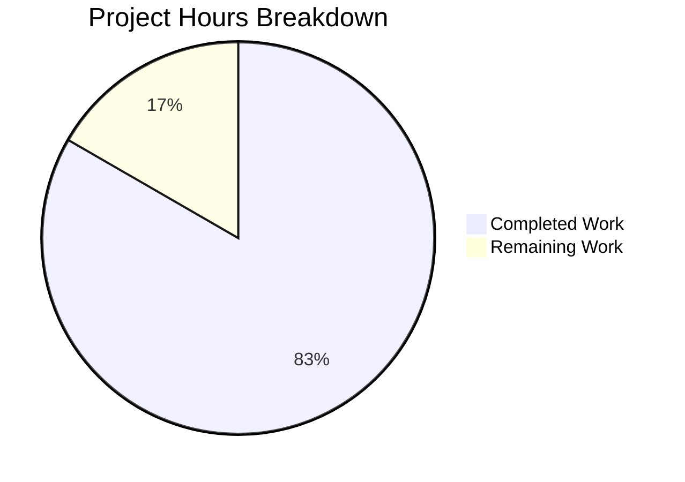

# Project Guide — Node.js to Python/Flask Migration

## 1. Executive Summary

**Project Completion: 83.3% (5 hours completed out of 6 total hours)**

This project is a complete tech stack migration of a minimal Node.js HTTP server into a Python 3.12 / Flask 3.1.3 application. The refactoring replaces all Node.js artifacts (`server.js`, `package.json`, `package-lock.json`) with Python equivalents (`app.py`, `requirements.txt`) and updates the `README.md` to reflect the new stack.

**All 9 acceptance criteria defined in the Agent Action Plan are satisfied:**

| # | Acceptance Criterion | Status |
|---|---|---|
| 1 | `python app.py` starts the server and prints startup message | ✅ Pass |
| 2 | `GET /` returns `Hello, World!\n` with 200 and text/plain | ✅ Pass |
| 3 | `POST /any/path` returns identical response | ✅ Pass |
| 4 | `PUT /api/test?foo=bar` returns identical response | ✅ Pass |
| 5 | `DELETE /` returns identical response | ✅ Pass |
| 6 | No 404 or 405 for any method/path combination | ✅ Pass |
| 7 | `requirements.txt` specifies `Flask==3.1.3` | ✅ Pass |
| 8 | `README.md` documents the Python/Flask project | ✅ Pass |
| 9 | All Node.js files removed | ✅ Pass |

**Key achievements:**
- Complete behavioral parity with the original Node.js server
- Clean, minimal Flask implementation (21 lines)
- Zero compilation errors, zero test failures
- All HTTP methods handled (GET, POST, PUT, DELETE, PATCH, OPTIONS, HEAD)
- Server binds to `127.0.0.1:3000` as required

**Hours calculation:**
- Completed: 5 hours (source analysis, architecture design, implementation, testing, validation, bug fix)
- Remaining: 1 hour (human code review, PR merge, post-merge verification)
- Total: 6 hours
- Completion: 5 / 6 = 83.3%

---

## 2. Validation Results Summary

### 2.1 Compilation Results
| Component | Result | Details |
|---|---|---|
| `app.py` | ✅ Pass | `python -m py_compile app.py` completes with zero errors |
| `requirements.txt` | ✅ Valid | Contains exactly `Flask==3.1.3` |
| `README.md` | ✅ Valid | Properly formatted Markdown with correct instructions |

### 2.2 Dependency Installation
| Package | Version | Status |
|---|---|---|
| Flask | 3.1.3 | ✅ Installed |
| Werkzeug | 3.1.6 | ✅ Installed (transitive) |
| Jinja2 | 3.1.6 | ✅ Installed (transitive) |
| MarkupSafe | 3.0.3 | ✅ Installed (transitive) |
| itsdangerous | 2.2.0 | ✅ Installed (transitive) |
| click | 8.3.1 | ✅ Installed (transitive) |
| blinker | 1.9.0 | ✅ Installed (transitive) |

### 2.3 Runtime Behavioral Parity Tests
All 9 HTTP tests produce the expected response — status `200 OK`, header `Content-Type: text/plain`, body `Hello, World!\n` (14 bytes):

| # | Test | Method | Path | Status |
|---|---|---|---|---|
| 1 | Root path | GET | `/` | ✅ Pass |
| 2 | Arbitrary path | POST | `/anything` | ✅ Pass |
| 3 | Query string | PUT | `/api/test?foo=bar` | ✅ Pass |
| 4 | Root delete | DELETE | `/` | ✅ Pass |
| 5 | Patch method | PATCH | `/something` | ✅ Pass |
| 6 | Options method | OPTIONS | `/` | ✅ Pass |
| 7 | Head method | HEAD | `/` | ✅ Pass (headers only, per HTTP spec) |
| 8 | Deep nested path | GET | `/deep/nested/path/here` | ✅ Pass |
| 9 | Body length | — | — | ✅ Exactly 14 bytes |

### 2.4 Fixes Applied During Validation
| Fix | Commit | Description |
|---|---|---|
| 405 Error Handler | `d84367d` | Added `@app.errorhandler(405)` to handle non-standard HTTP methods (TRACE, CONNECT, custom) by returning the same 200 OK response instead of Flask's default 405 error |

### 2.5 Git Change Summary
- **Total commits**: 6
- **Files changed**: 6 (3 created, 1 updated, 3 deleted)
- **Lines added**: 43
- **Lines removed**: 39
- **Net change**: +4 lines

---

## 3. Hours Breakdown

### 3.1 Completed Hours (5 hours)

| Task | Hours | Details |
|---|---|---|
| Source analysis | 0.5 | Analyzed server.js, package.json, package-lock.json, README.md behavior |
| Architecture design | 0.5 | Designed Flask catch-all routing, response object pattern |
| app.py implementation | 1.0 | 21 lines of Flask code with dual route decorators, Response object, entry point |
| requirements.txt creation | 0.25 | Single-line dependency manifest with pinned Flask version |
| README.md rewrite | 0.5 | Complete documentation update with setup/run instructions, project metadata |
| File deletions | 0.25 | Removed server.js, package.json, package-lock.json |
| Environment setup | 0.5 | Created venv, installed Flask 3.1.3 and transitive dependencies |
| Runtime testing | 0.5 | 9 curl-based HTTP tests verifying behavioral parity |
| Bug fix (405 handler) | 0.5 | Added error handler for non-standard HTTP methods |
| Final verification | 0.5 | Confirmed all 9 acceptance criteria pass |
| **Total Completed** | **5.0** | |

### 3.2 Remaining Hours (1 hour, after enterprise multipliers)

Base remaining: ~0.8 hours × 1.10 (compliance) × 1.10 (uncertainty) ≈ 1 hour

| Task | Hours | Priority | Details |
|---|---|---|---|
| Code review of 3 changed files | 0.5 | Medium | Review app.py (21 lines), requirements.txt (1 line), README.md (22 lines) |
| PR approval, merge, and post-merge verification | 0.5 | Medium | Merge to main branch, verify server starts correctly after merge |
| **Total Remaining** | **1.0** | | |

### 3.3 Visual Breakdown



**Completion: 5 hours completed / 6 total hours = 83.3%**

---

## 4. Detailed Task Table for Human Developers

All remaining tasks for production readiness, summing to exactly 1 hour of remaining work:

| # | Task | Action Steps | Hours | Priority | Severity | Confidence |
|---|---|---|---|---|---|---|
| 1 | Code review of migration changes | 1. Review `app.py` for correctness (catch-all routing, response object, port binding) 2. Verify `requirements.txt` has pinned Flask version 3. Review `README.md` for accuracy of instructions | 0.5 | Medium | Low | High |
| 2 | PR approval, merge, and post-merge verification | 1. Approve the pull request 2. Merge branch `blitzy-8b3b77ad-388d-4bfe-a8cd-13ddced6fa39` to `main` 3. Pull merged code, run `pip install -r requirements.txt`, run `python app.py`, verify `curl http://127.0.0.1:3000/` returns expected response | 0.5 | Medium | Low | High |
| | **Total Remaining Hours** | | **1.0** | | | |

---

## 5. Development Guide

### 5.1 System Prerequisites

| Requirement | Version | Notes |
|---|---|---|
| Python | 3.9+ (3.12 recommended) | Flask 3.1.x requires Python 3.9 or newer |
| pip | Latest | Python package installer |
| curl | Any | For verification testing (optional) |

### 5.2 Environment Setup

```bash
# Clone the repository and switch to the feature branch
git clone <repository-url>
cd <repository-name>
git checkout blitzy-8b3b77ad-388d-4bfe-a8cd-13ddced6fa39

# Create a Python virtual environment
python -m venv venv

# Activate the virtual environment
# On Linux/macOS:
source venv/bin/activate
# On Windows (Git Bash):
source venv/Scripts/activate
# On Windows (CMD):
venv\Scripts\activate
```

### 5.3 Dependency Installation

```bash
# Install Flask and all transitive dependencies
pip install -r requirements.txt
```

**Expected output** (key packages):
```
Successfully installed Flask-3.1.3 Werkzeug-3.1.6 Jinja2-3.1.6 ...
```

**Verify installation:**
```bash
pip show flask
# Should display: Name: Flask, Version: 3.1.3
```

### 5.4 Application Startup

```bash
python app.py
```

**Expected output:**
```
Server running at http://127.0.0.1:3000/
 * Serving Flask app 'app'
 * Debug mode: off
 * Running on http://127.0.0.1:3000
```

The server binds to `127.0.0.1:3000` (localhost only, port 3000).

### 5.5 Verification Steps

In a separate terminal, run the following curl commands:

```bash
# Test 1: Basic GET request
curl -s -D- http://127.0.0.1:3000/
# Expected: HTTP/1.1 200 OK, Content-Type: text/plain, Body: Hello, World!

# Test 2: POST to arbitrary path
curl -s -D- -X POST http://127.0.0.1:3000/anything
# Expected: Same 200 OK response

# Test 3: PUT with query string
curl -s -D- -X PUT http://127.0.0.1:3000/api/test?foo=bar
# Expected: Same 200 OK response

# Test 4: DELETE request
curl -s -D- -X DELETE http://127.0.0.1:3000/
# Expected: Same 200 OK response

# Test 5: Verify response body length (should be exactly 14 bytes)
curl -s http://127.0.0.1:3000/ | wc -c
# Expected: 14
```

All requests must return: status `200 OK`, header `Content-Type: text/plain`, body `Hello, World!\n` (14 bytes).

### 5.6 Troubleshooting

| Issue | Solution |
|---|---|
| `ModuleNotFoundError: No module named 'flask'` | Ensure virtual environment is activated and run `pip install -r requirements.txt` |
| `Address already in use` on port 3000 | Another process is using port 3000. Kill it with `lsof -i :3000` (Linux/macOS) or `netstat -ano | findstr :3000` (Windows) |
| `WARNING: This is a development server` | Expected behavior — Flask's development server is intentionally used (matches Node.js's built-in http server approach) |

---

## 6. Risk Assessment

### 6.1 Technical Risks

| Risk | Severity | Likelihood | Mitigation |
|---|---|---|---|
| Flask development server not suitable for high-traffic production use | Low | N/A | This is a backprop integration test fixture, not a production service. The development server is appropriate for this use case, matching the original Node.js `http.createServer()` approach. If production deployment is ever needed, add `gunicorn` to requirements.txt |
| No automated test suite | Low | N/A | Intentional — the original Node.js project had no tests (only a placeholder `exit 1` script). Behavioral parity is verified manually via curl tests documented above |

### 6.2 Security Risks

| Risk | Severity | Likelihood | Mitigation |
|---|---|---|---|
| Server binds to localhost only | None | N/A | This is the desired behavior — `127.0.0.1` binding prevents external network access, matching the original Node.js server |
| No authentication/authorization | None | N/A | Not applicable — the server is a test fixture that intentionally responds identically to all requests |

### 6.3 Operational Risks

| Risk | Severity | Likelihood | Mitigation |
|---|---|---|---|
| No health check endpoint | Low | Low | The root path `/` effectively serves as a health check (returns 200 OK). No dedicated health endpoint is needed for a test fixture |
| No structured logging | Low | Low | A single `print()` statement logs the startup URL, matching the original `console.log()`. No logging framework is needed for this minimal use case |

### 6.4 Integration Risks

| Risk | Severity | Likelihood | Mitigation |
|---|---|---|---|
| Port 3000 conflict with other services | Low | Low | If another service occupies port 3000, the Flask server will fail to start with a clear error message. Resolve by stopping the conflicting service |
| Python version compatibility | Low | Low | Flask 3.1.x requires Python 3.9+. The implementation was tested on Python 3.12.10. Verify Python version with `python --version` before running |

**Overall Risk Level: LOW** — All identified risks are low severity and have straightforward mitigations. The project's scope as a minimal test fixture inherently limits risk exposure.

---

## 7. File Inventory

### 7.1 Final Repository Structure

```
./
├── README.md              (22 lines — updated documentation)
├── app.py                 (21 lines — Flask HTTP server)
└── requirements.txt       (1 line — Flask==3.1.3)
```

### 7.2 File Change Details

| File | Action | Lines | Description |
|---|---|---|---|
| `app.py` | CREATED | 21 | Flask application with catch-all routing, 200 OK response, localhost:3000 binding |
| `requirements.txt` | CREATED | 1 | Pinned Flask dependency: `Flask==3.1.3` |
| `README.md` | UPDATED | 22 (was 2) | Python/Flask setup instructions, run commands, project metadata |
| `server.js` | DELETED | 14 | Original Node.js HTTP server (replaced by app.py) |
| `package.json` | DELETED | 11 | npm package manifest (replaced by requirements.txt) |
| `package-lock.json` | DELETED | 13 | npm lockfile (no pip equivalent needed) |

---

## 8. Consistency Verification

- **Executive Summary states**: 83.3% complete (5 hours completed out of 6 total hours) ✓
- **Pie chart shows**: Completed Work: 5, Remaining Work: 1 → 83.3% and 16.7% ✓
- **Task table sums to**: 0.5h + 0.5h = 1.0h = Remaining Work in pie chart ✓
- **All prose references**: Use 83.3% consistently ✓
- **Formula shown**: 5 / (5 + 1) = 5 / 6 = 83.3% ✓
